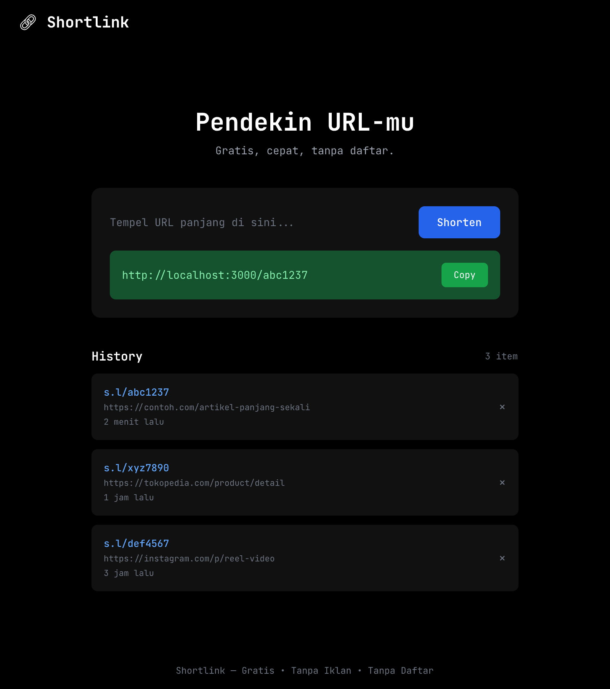

# 🔗 Shortlink

URL pendek sederhana — gratis, cepat, tanpa ribet. Tempel URL panjang, dapat link pendek instan. Tanpa daftar, tanpa login.



## Fitur

- **Shorten instan** — URL panjang → pendek dalam < 1 detik
- **Auto-copy** — Link pendek langsung tersalin ke clipboard
- **Preview URL** — Lihat title + domain sebelum di-shorten
- **History lokal** — Riwayat link tersimpan di browser (localStorage)
- **Redirect 301** — Permanent redirect, cepat dengan cache
- **Full dark theme** — Latar hitam, nyaman dilihat
- **JetBrains Mono** — Font monospace khas database tools
- **Rate limit** — 100 req/min per IP
- **SSRF protection** — URL private network di-block
- **Responsive** — Mobile-first, siap untuk WA/IG

## Tech Stack

| Layer | Teknologi |
|-------|-----------|
| Frontend | Vanilla HTML + CSS + Tailwind CDN |
| Font | JetBrains Mono (Google Fonts) |
| Backend | Express.js 5 |
| Database | SQLite (better-sqlite3) |
| Cache | In-memory LRU (lru-cache) |
| Template | EJS |
| Runtime | Node.js 22 |

## Quick Start

```bash
# Clone
git clone https://github.com/farhankhuwais/shortlink.git
cd shortlink

# Install
npm install

# Setup env
cp .env.example .env

# Run development
npm run dev
```

Buka `http://localhost:3000`.

## API

| Method | Path | Deskripsi |
|--------|------|-----------|
| POST | `/api/shorten` | Shorten URL |
| GET | `/api/preview?url=` | Preview title + domain |
| GET | `/:code` | Redirect ke URL asli |

### Shorten URL

```bash
curl -X POST http://localhost:3000/api/shorten \
  -H "Content-Type: application/json" \
  -d '{"url":"https://contoh.com/panjang-sekali"}'
```

Response:

```json
{
  "shortUrl": "http://localhost:3000/abc1237",
  "shortCode": "abc1237",
  "originalUrl": "https://contoh.com/panjang-sekali"
}
```

## Environment Variables

| Variable | Default | Description |
|----------|---------|-------------|
| `PORT` | `3000` | Port server |
| `NODE_ENV` | `development` | Environment |
| `BASE_URL` | `http://localhost:3000` | Base URL untuk short link |
| `DATABASE_PATH` | `./data/shortlink.db` | Path SQLite file |
| `CACHE_MAX` | `10000` | Max LRU cache entries |
| `RATE_LIMIT_WINDOW_MS` | `60000` | Rate limit window (ms) |
| `RATE_LIMIT_MAX` | `100` | Max requests per window |

## Docker

```bash
docker build -t shortlink .
docker run -p 8080:8080 \
  -v shortlink_data:/app/data \
  -e NODE_ENV=production \
  shortlink
```

## Struktur Folder

```
src/
├── config/        # DB + cache config
├── controllers/   # Request handlers
├── middleware/     # Rate limiter, error handler
├── routes/        # Express routers
├── services/      # Business logic
├── utils/         # Hash generator, URL validator
└── views/         # EJS templates
public/
├── css/           # Styles
└── js/            # Client-side app
```

## Keamanan

| File | Status | Keterangan |
|------|--------|------------|
| `.env` | ❌ Ignored | File environment pribadi — jangan commit |
| `.env.example` | ✅ Tracked | Template aman (placeholder) — bebas di-push |
| `data/*.db` | ❌ Ignored | Database SQLite — berisi data asli |
| `node_modules/` | ❌ Ignored | Dependencies — terlalu besar & tidak perlu |
| `*.db-shm` / `*.db-wal` | ❌ Ignored | File WAL SQLite — ikut terignore |

> **Global gitignore** sudah terpasang di `$HOME\.config\git\global-ignore`. Setiap project baru (`git init`) otomatis terproteksi — tidak perlu buat `.gitignore` manual.

## Lisensi

MIT
